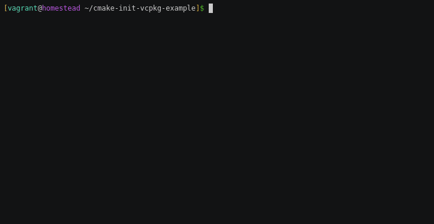

# cmake-init + vcpkg

This is an example repository showcasing [vcpkg][1] integration with
[cmake-init][2] generated projects downloading dependencies from GitHub.

The list of changes to make when integrating with vcpkg:

* Add a [vcpkg manifest](vcpkg.json)
* Add a `vcpkg` preset to [`CMakePresets.json`](CMakePresets.json#L9)
* Inherit from the above preset in your [CI](CMakePresets.json#L62) and [dev
  presets](HACKING.md#L44)
* Mention in [`HACKING.md`](HACKING.md#L60) that the project uses vcpkg
* Mention in [`BUILDING.md`](BUILDING.md#L3) that the project provides vcpkg
  port files for its dependencies and it is one option to use those
* Install vcpkg in the [CI](.github/workflows/ci.yml#L12) workflow

Every other change in the repository was made just to make this repository more
focused on showing how to integrate with vcpkg, like removing unused presets
and the tests, and trimming the CI workflow yaml.

[1]: https://github.com/microsoft/vcpkg
[2]: https://github.com/friendlyanon/cmake-init
